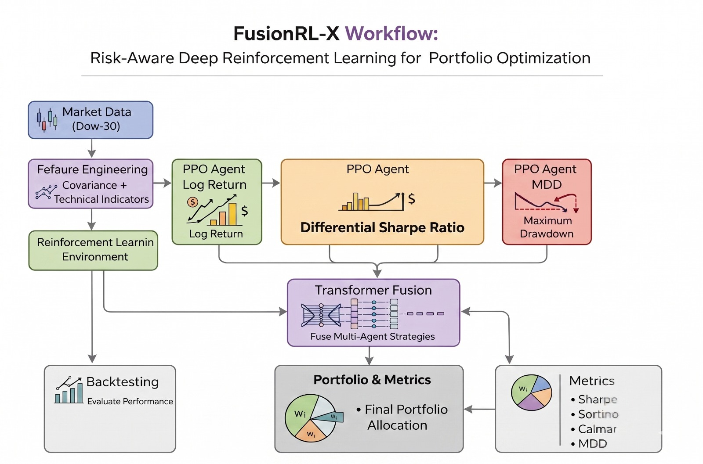

# FusionRL-X
**Risk-Adjusted Deep Reinforcement Learning for Portfolio Optimization

Multi-Reward Fusion with Transformer-Based Decision Aggregation

# Overview
This is a course projesct that implements a Risk Adjusted Deep Reinforcement Learning (RA-DRL) framework for portfolio optimization using a multi-reward, multi-agent architecture.
Traditional RL-based portfolio strategies optimize a single objective, often leading to unstable or impractical investment behavior. This project addresses that limitation by:

1. Training three specialized PPO agents, each optimized for a distinct financial objective and
2. Combining their decisions using a Transformer-based fusion module and
3. Producing a single, risk-aware portfolio allocation strategy

---

## The Problem

Triaditional portfolio optimization methods, such as Mean-Variance Optimization (MVO), rely on strong assumptions like normally distributed returns, and linear relationships between assets. The  real-world financial markets, are highly dynamic, non-stationary, and influenced by complex, nonlinear interactions due to which these assumptions often fails.
Furthermore, single-agent DRL models are less robust in practical deployment.
Real markets demand a balance between growth, stability, and downside protection.

The goal is to develop a system that can:
1. Simultaneously optimize multiple financial objectives  
2. Adapt to changing market regimes  
3. Generate stable and risk-aware portfolio allocations  
4. Outperform traditional and single-agent baselines 

---

## Our Approach

Recent advances in Deep Reinforcement Learning (DRL) have enabled adaptive portfolio strategies by learning directly from market data. This leads to suboptimal behavior, as financial decision-making inherently involves balancing multiple conflicting objectives, including return maximization, risk control, and drawdown minimization.
We decompose the problem into three specialized learning objectives:

| Agent | Reward Function | Goal |
|:------|:----------------|:-----|
| Agent 1 |	Log Returns | Maximize growth |
| Agent 2 | Differential Sharpe Ratio (DSR) | Optimize risk-adjusted returns |
|Agent 3 | Maximum Drawdown (MDD) |	Minimize large losses |


Instead of choosing one, we are fusing all three decisions using a Transformer model, which enables:
1. Context aware weighting of strategies
2. Temporal dependency modeling
3. Adaptive risk balancing

This approach aims to bridge the gap between theoretical portfolio optimization and real-world financial decision-making.

---

## 📊 Workflow



---

##  Project Structure

```
├── ra_drl/                            # Core source code
│   ├── agents/                        # RL agents and pipelines
│   │   ├── ppo_agent.py                PPO trading agent implementation
│   │   ├── train_agents.py             Training loop for agents
│   │   └── evaluate_agents.py          Evaluation of trained agents
│   │
│   ├── benchmarks/                    # Baseline strategies for comparison
│   │   └── baselines.py
│   │
│   ├── data/                          # Data acquisition & preprocessing
│   │   ├── download_data.py            Fetches raw market data
│   │   └── feature_engineering.py      Generates model-ready features
│   │
│   ├── envs/                          # Custom RL environments
│   │   └── portfolio_env.py            Portfolio optimization environment
│   │
│   ├── fusion/                        # Hybrid learning modules
│   │   ├── supervised_pretraining.py   Supervised learning pretraining
│   │   └── transformer_fusion.py       Transformer-based feature fusion
│   │
│   ├── models/                        # Saved model checkpoints (auto-generated)
│   ├── results/                       # Logs, metrics, visualizations (auto-generated)
│   │
│   ├── utils/                         # Helper utilities
│   │   ├── rewards.py                  Custom reward functions
│   │   ├── metrics.py                  Performance evaluation metrics
│   │   ├── visualization.py            Plotting and visualization tools
│   │   └── statistical_testing.py      Statistical significance testing
│   │
│   ├── backtest.py                    # Backtesting script for trained models
│   ├── config.py                      # Central configuration (hyperparameters, paths)
│   └── train.py                       # Main training entry point
│
├── README.md                          # Project documentation
├── requirements.txt                   # Python dependencies
└── .gitignore                         # Git ignore rules
```

---

## Dataset

**Dataset:** Dow 30 (Dow Jones Industrial Average constituents)  
**Source:** Yahoo Finance  
**Frequency:** Daily (OHLCV)  

###  Features (State Space)

**Covariance Matrix**  
- Captures relationships between asset returns  

**Technical Indicators**  
- SMA (30, 60)  
- MACD  
- RSI  
- ADX  
- CCI  
- Bollinger Bands  

---
      
## Model Components

### 1. Base RL Agent
- **Algorithm:** Proximal Policy Optimization (PPO)  
- **Architecture:** Actor-Critic Networks  

### 2. Reward Functions
- Log Return  
- Differential Sharpe Ratio (DSR)  
- Maximum Drawdown (MDD)  

### 3. Fusion Module
- **Architecture:** Transformer Encoder  
- **Input:** Actions from 3 PPO agents  
- **Output:** Final portfolio weights  

---
  
## Evaluation Metrics

| Metric | Description |
|:-------|:------------|
| Sharpe Ratio | Risk-adjusted return |
| Sortino Ratio | Downside risk focus |
| Calmar Ratio | Return vs drawdown |
| Omega Ratio |	Gain/loss distribution |
| Annual Return	| Yearly performance |
| Max Drawdown | Worst loss |
| Volatility | Risk level |

---

## Expected Outcomes

- Robust portfolio performance with enhanced risk-adjusted returns  
- Reduced drawdowns compared to single-objective reinforcement learning approaches  
- Consistent performance across different market regimes:
  - Bull markets  
  - Bear markets  
  - Sideways markets
 
--- 

## Requirements

- **Python:** 3.10+  
- **GPU (recommended):** CUDA-capable GPU (≥ 4 GB VRAM)  
- **RAM:** 8 GB minimum (16 GB recommended for smoother training)  
- **Disk Space:**  
  - ~4 GB for dataset storage  
  - Additional space for model checkpoints and results  

### Notes
- The project can run on CPU, but training will be significantly slower  
- If you face memory issues:
  - Reduce batch size or training steps in `config.py`  
  - Limit number of assets or time window in dataset  
- Compatible with:
  - Google Colab (T4 runtime recommended)  
  - Local GPU setups  

---

## How to Run

Run everything from project root.

### Install dependencies
```
    pip install -r requirements.txt
```

### Download Data
```
    python data/download_data.py
```

### Train PPO Agents
```
    python agents/train_agents.py
```

### Supervised Pre-training
```
    python fusion/supervised_pretraining.py
```

### Train Transformer Fusion
```
    python train.py
```

### Backtesting
```
    python backtest.py
```

### Visualization
```
    python utils/visualization.py
```

---
      
## References
 1. [Risk-Adjusted Deep Reinforcement Learning for Portfolio Optimization: A Multi-reward Approach (2025)](https://link.springer.com/article/10.1007/s44196-025-00875-8)
 2. [Deep Reinforcement Learning for Portfolio Selection](https://www.sciencedirect.com/science/article/pii/S1044028324000887)

---

##  Future Work

- This model can be extended to multiple markets (e.g., Sensex, NASDAQ)  
- This enables real time trading and deployment  
- Incorporation of risk-aware transformer architectures with attention constraints  

---

## Contributors
- [Diksha Agrawal](https://github.com/SilentAbstractDebugger)
- [Aastha Sharma](https://github.com/Aastha0107)
- [Gaurav Kumar](https://github.com/sekiroQ-Q)

---

##  License

MIT License.

